<!-- markdownlint-disable MD033 -->

# Quiz Application

A beautiful, feature-rich Flutter quiz application with LaTeX support for mathematical expressions, dynamic JSON-based content management, statistics tracking, and HTML export functionality.

---

<p align="center">
  
  
  
  
</p>

---

## Preview

| Light Mode | Dark Mode |
| :---: | :---: |
| 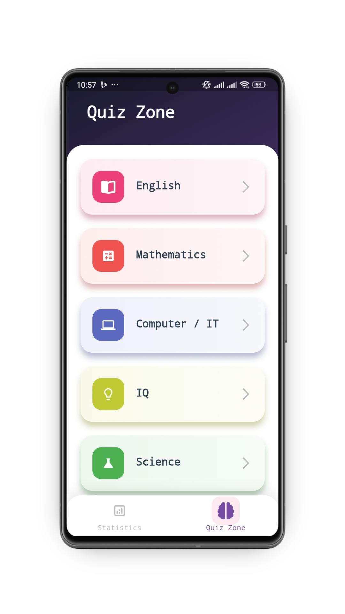 | 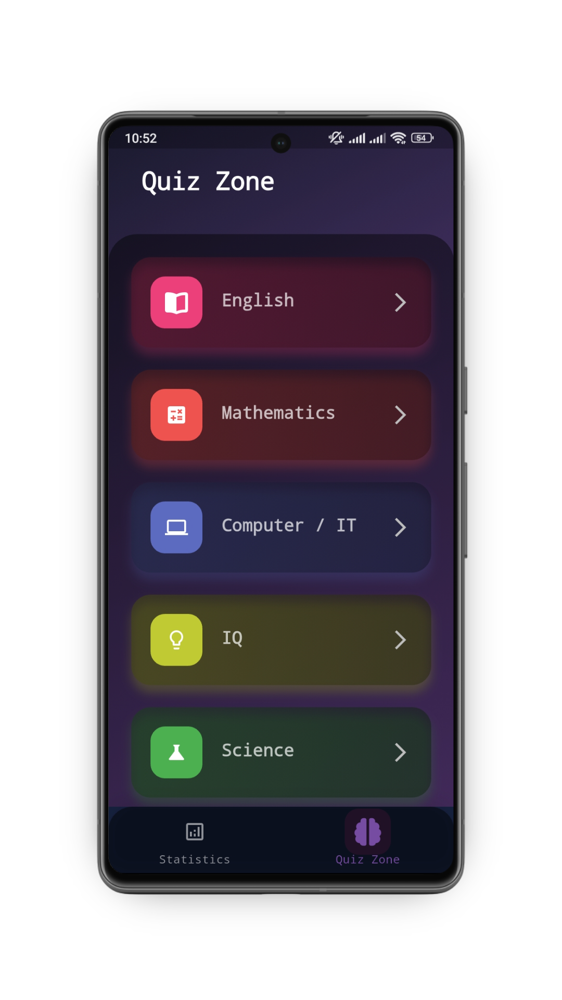 |
| 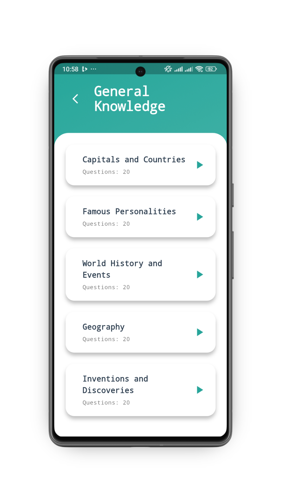 | 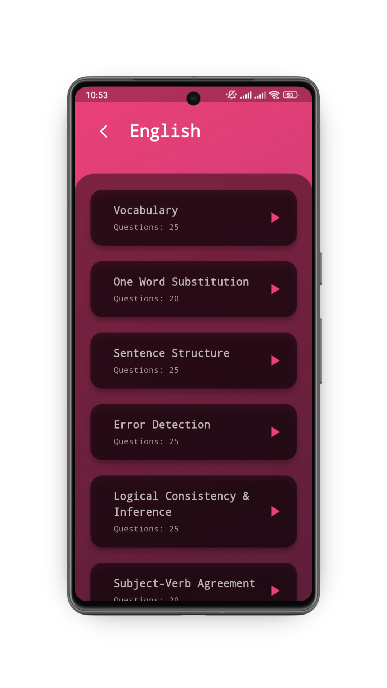 |
| 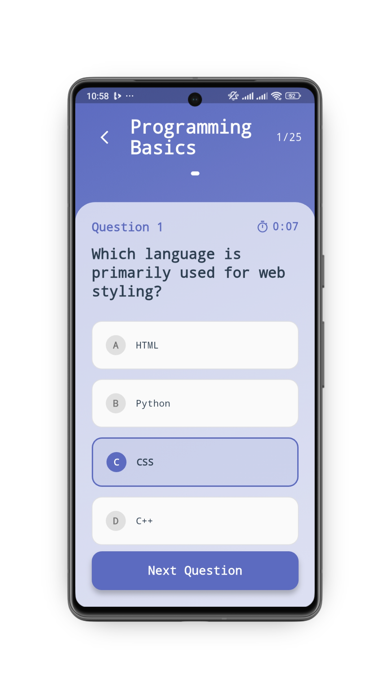 | 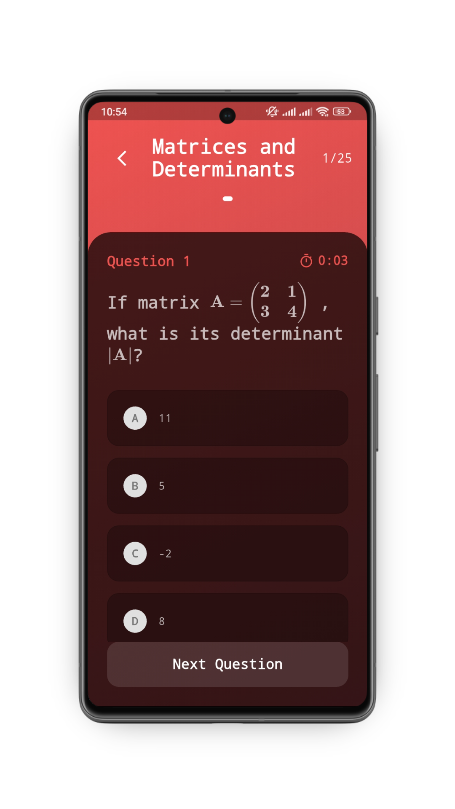 |
| 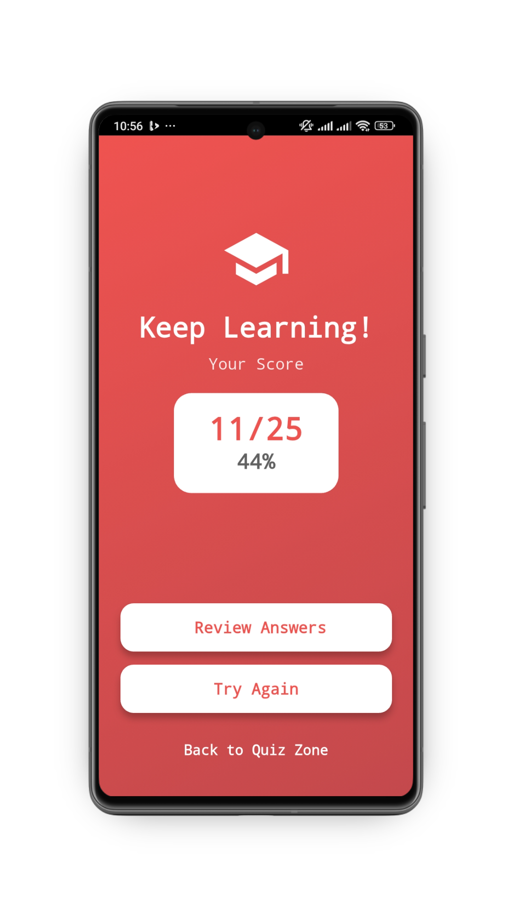 | 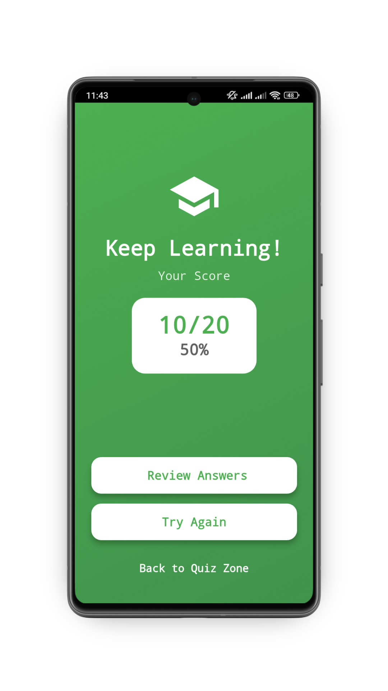 |
| 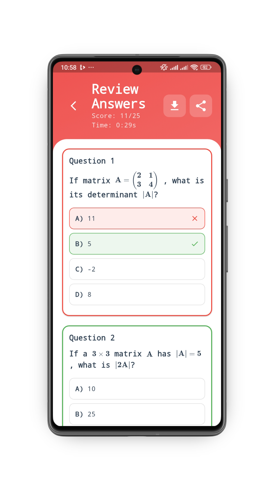 | 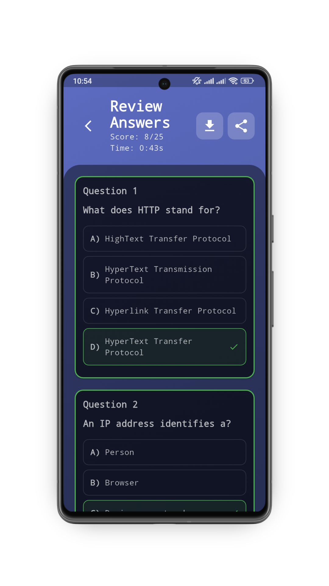 |
| 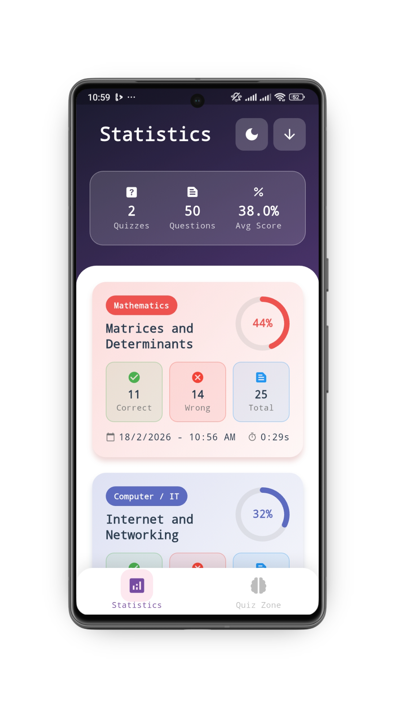 | 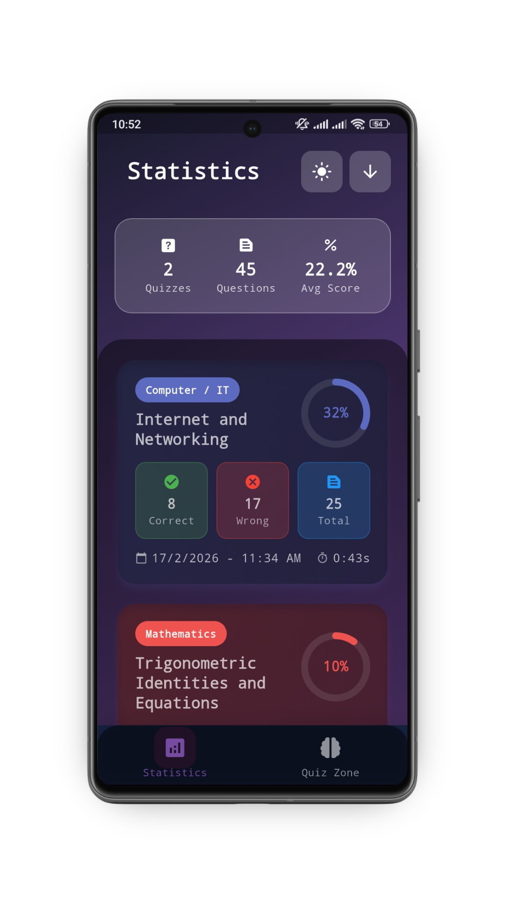 |

| Delete Dialog | Quit Dialog |
| :---: | :---: |
| 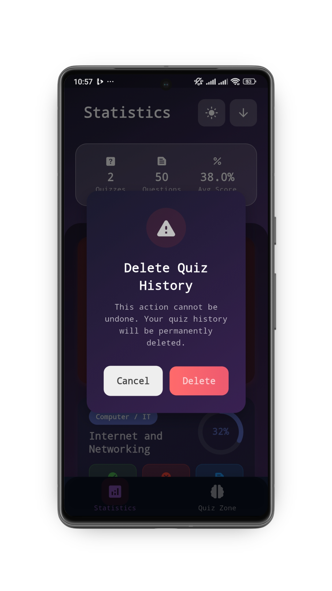 | 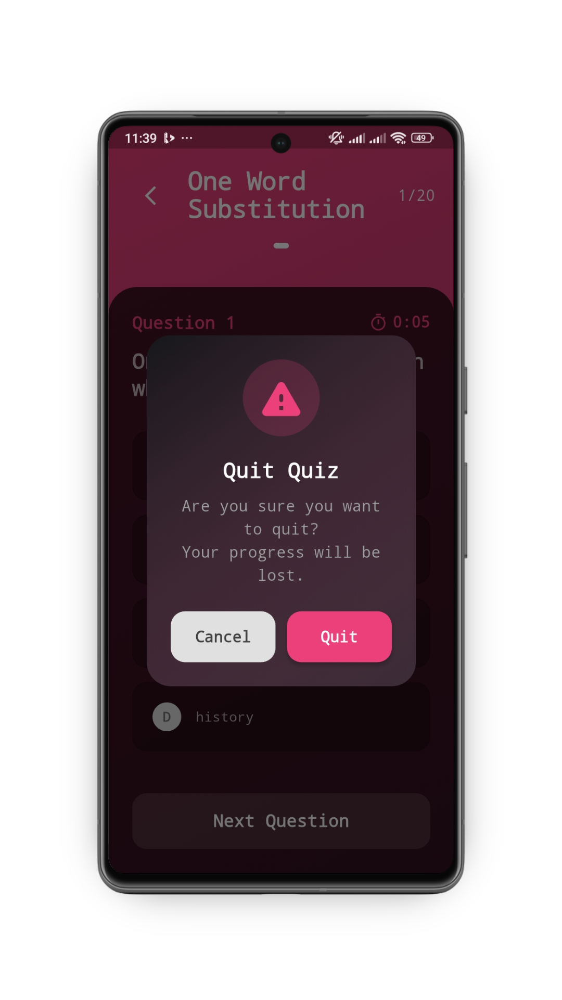 |

---

## Screens Overview

### 1. Home Screen (Quiz Zone)

- List of all subjects

### 2. Topic Selection Screen

- List of subtopics for selected subject
- MCQ count per topic

### 3. Quiz Screen

- One question at a time
- Progress indicator (1/10, 2/10, etc.)
- Next button after selecting the answer

### 4. Result Screen

- Final score with percentage
- Performance message
- "Review Answers" button
- "Back to Quiz Zone" option

### 5. Review Screen

- All questions with your answers
- Correct answers highlighted in green
- Wrong answers highlighted in red
- LaTeX rendered perfectly
- Share & Download button to export as HTML

### 6. Statistics Screen

- Dark / Light Mode Toggle
- Oldest / Newest History Toggle
- Statistics Card of all quiz attempts
- Date, Time, Subject, Topic, Score for each attempt
- **Tap** to review that quiz
- **Long press** to delete that attempt
- Empty state if no history

### 7. Dialogs

- Delete Dialog (Long press on Statistics Card to delete that Quiz attempt)
- Quit Dialog (Quit quiz)

---

## Features

- **Beautiful Material Design UI** with glassmorphism effects
- **LaTeX Support** for mathematical equations and formulas
- **Dark/Light Mode** - Toggle between themes seamlessly
- **Statistics Dashboard** - Track your quiz history and performance
- **Detailed Review Screen** with correct/wrong answers highlighted
- **Dynamic Content** - Add subjects, topics, and questions via JSON
- **HTML Export & Download** - Share or Save quiz results with fully rendered LaTeX
- **Score Tracking** with percentage calculations
- **Timer Tracking** - See how long each quiz takes
- **Animated Transitions** - Smooth UI flows between questions
- **History Management** - Long-press to delete quiz attempts
- **Persistent Storage** - History and theme settings saved locally

---

## Getting Started

### Prerequisites

- Flutter SDK (3.0 or higher) - **used 3.38.6**
- Dart SDK - **used 3.10.7**
- Android Studio / VS Code
- An Android/iOS device or emulator
  
---

## Dependencies

The following dependencies are used in the project:

`pubspec.yaml`

```yaml
dependencies:
  flutter:
    sdk: flutter
  shared_preferences: ^2.5.4    # Local data persistence
  provider: ^6.1.5+1            # State management
  path_provider: ^2.1.5         # File system access
  latext: ^0.5.1                # LaTeX rendering
  intl: ^0.20.2                 # Date/time formatting
  font_awesome_flutter: ^10.12.0  # Icon library
  share_plus: ^12.0.1           # Sharing functionality
  open_file: ^3.5.11            # Open file functionality
```

**Note:** All dependency versions may vary. Check the latest versions on [pub.dev](https://pub.dev)

---

## Project Structure

```text
quiz_app/
├── lib/
│   ├── Models/
│   │   ├── subject.dart           # Subject model
│   │   ├── subtopics.dart         # SubTopic and Question models
│   │   ├── questions.dart         # Question model
│   │   ├── quiz_data_service.dart # Singleton service for data management
│   │   └── quiz_history.dart      # Quiz history and record management
│   ├── Providers/
│   │   ├── statistics_provider.dart   # Manage quiz history and aggregate stats
│   │   └── theme_provider.dart        # Dynamic light/dark theme state
│   ├── Screens/
|   │   ├── home_screen.dart          # Main subjects screen
|   │   ├── sub_topic_screen.dart     # Topics list screen
|   │   ├── quiz_screen.dart          # Quiz interface
|   │   ├── review_screen.dart        # Detailed review with HTML export
|   │   ├── statistics_screen.dart    # Quiz history and statistics
│   ├── theme/
│   │   └── app_theme.dart        # managing application-wide themes and colors
│   ├── Widgets/
│   │   ├── bottom_nav_bar.dart   # Adaptive navigation system
│   │   ├── common_widgets.dart   # Reusable UI (GlassContainer, ScreenHeader)
│   │   └── dialogs.dart          # Custom styled alerts and modals
│   └── main.dart                 # App initialization & provider setup
├── assets/
│   └── mcqs.json                 # Central Database for all quiz content
└── pubspec.yaml                  # Manages application dependencies
```

---

## JSON Structure

> [!IMPORTANT]
> All MCQs are stored **manually** in the `assets/mcqs.json` file.
> The UI **automatically updates** based on whatever subjects, topics, questions, and options you add to this file — no code changes required.
> Simply edit `mcqs.json`, save, and the app reflects your changes instantly.

### Format

```json
[
  {
    "name": "Mathematics",
    "mcqs": 185,
    "subtopics": [
      {
        "name": "Algebra Basics",
        "mcqs": 25,
        "questions": [
          {
            "question": "Solve for x: $2x + 5 = 15$",
            "options": [
              "$x = 5$",
              "$x = 10$",
              "$x = 7.5$",
              "$x = 2.5$"
            ],
            "answer": "$x = 5$"
          }
        ]
      }
    ]
  }
]
```

---

## Field Descriptions

### Root Array Structure

The JSON file contains an **array of subject objects**.

### Subject Object

| Field       | Type    | Description                | Example                      |
|-------------|---------|----------------------------|------------------------------|
| `name`      | String  | Subject display name       | `"Mathematics"`, `"English"` |
| `mcqs`      | Integer | Total questions in subject | `185`                        |
| `subtopics` | Array   | List of subtopics          | See below                    |

### SubTopic Object

| Field       | Type    | Description                     | Example            |
|-------------|---------|---------------------------------|--------------------|
| `name`      | String  | Subtopic display name           | `"Algebra Basics"` |
| `mcqs`      | Integer | Number of questions in subtopic | `25`               |
| `questions` | Array   | List of question objects        | See below          |

### Question Object

| Field      | Type          | Description                                    | Example                             |
|------------|---------------|------------------------------------------------|-------------------------------------|
| `question` | String        | Question text (supports LaTeX)                 | `"What is $\\frac{1}{2}$?"`         |
| `options`  | Array[String] | 4 answer choices (supports LaTeX)              | `["$0.5$", "$2$", "$1$", "$0.25$"]` |
| `answer`   | String        | Correct answer (must match one option exactly) | `"$0.5$"`                           |

**Important:** The `answer` field must **exactly match** one of the options.

---

## Example: Complete Subject Addition

Here's a full example of adding a "Chemistry" subject:

```json
[
  {
    "name": "Chemistry",
    "mcqs": 50,
    "subtopics": [
      {
        "name": "Periodic Table",
        "mcqs": 25,
        "questions": [
          {
            "question": "What is the atomic number of Carbon?",
            "options": ["6", "12", "14", "8"],
            "answer": "6"
          },
          {
            "question": "Which element has the symbol $Fe$?",
            "options": ["Iron", "Fluorine", "Fermium", "Flerovium"],
            "answer": "Iron"
          },
          {
            "question": "What is $H_2O$ commonly known as?",
            "options": ["Water", "Hydrogen Peroxide", "Heavy Water", "Hydroxy"],
            "answer": "Water"
          }
          // Add 22 more questions to reach mcqs: 25
        ]
      },
      {
        "name": "Chemical Reactions",
        "mcqs": 25,
        "questions": [
          {
            "question": "Balance: $H_2 + O_2 \\rightarrow H_2O$",
            "options": [
              "$2H_2 + O_2 \\rightarrow 2H_2O$",
              "$H_2 + O_2 \\rightarrow H_2O$",
              "$H_2 + 2O_2 \\rightarrow 2H_2O$",
              "$4H_2 + 2O_2 \\rightarrow 4H_2O$"
            ],
            "answer": "$2H_2 + O_2 \\rightarrow 2H_2O$"
          }
          // Add 24 more questions
        ]
      }
    ]
  }
  // Keep existing subjects (Math, English, etc.)
]
```

**Remember:** Total `mcqs` in subject = sum of all subtopic `mcqs`

---

## Statistics Screen

### Features

The **Statistics** screen shows your complete quiz history with:

- **Date & Time** of each quiz attempt
- **Time** taken to complete the quiz
- **Subject & Topic** taken
- **Score** with percentage
- **Total Questions** attempted
- **Performance** color-coded (Green = Correct, Red = Wrong)

### How to Use

1. **View History:**
    - Click on the "Statistics" card on the home screen
    - See all your past quiz attempts in Newest / Oldest order.

2. **Review Answers:**
    - **Tap** on any quiz card to review all questions and answers
    - See which questions you got right/wrong

3. **Delete History:**
    - **Long press** (hold) on any quiz card
    - Confirmation dialog appears
    - Tap "Delete" to remove that quiz attempt

4. **Empty State:**
    - If you haven't taken any quizzes yet, you'll see a friendly message
    - Start taking quizzes to build your statistics!

### Statistics Features

- **Persistent Storage** - History saved even after closing the app
- **Performance Tracking** - Monitor your progress over time
- **Detailed Review** - Click to see complete answer breakdown
- **Easy Management** - Long-press to delete unwanted records
- **Color-Coded** - Visual indicators for performance levels

---

## Colors & Typography

### Font

The app uses **`monospace`** as the font family (applied globally via `app_theme.dart`).

### Colors

#### Primary Gradient (AppBar / Headers)

| Role           | Color     | Hex       |
|----------------|-----------|-----------|
| Gradient Start | Deep Navy | `#1A1A2E` |
| Gradient End   | Purple    | `#764ba2` |

#### Light Theme

| Role               | Color              | Hex                |
|--------------------|--------------------|--------------------|
| Background/Surface | White              | `#FFFFFF`          |
| Primary Text       | Dark Slate         | `#2C3E50`          |
| Primary Accent     | Blue               | `Colors.blue`      |
| Button/Label Text  | White              | `#FFFFFF`          |
| Subtle Text        | Grey               | `Colors.grey[600]` |
| Border/Outline     | Light Grey         | `Colors.grey[300]` |

#### Dark Theme

| Role               | Color              | Hex                |
|--------------------|--------------------|--------------------|
| Background/Surface | Dark Navy          | `#16213E`          |
| Primary Text       | White (70%)        | `Colors.white70`   |
| Card Background    | Semi-black         | `Colors.black45`   |
| Subtle Text        | White (60%)        | `Colors.white60`   |
| Border/Outline     | White (12%)        | `Colors.white12`   |

#### Subject Colors

| Subject             | Color                    |
|---------------------|--------------------------|
| English             | `Colors.pink.shade400`   |
| Mathematics         | `Colors.red.shade400`    |
| Computer / IT       | `Colors.indigo.shade400` |
| IQ                  | `Colors.lime.shade600`   |
| Science             | `Colors.green`           |
| General Knowledge   | `Colors.teal.shade400`   |
| Default (fallback)  | `Colors.blueGrey`        |

---

### Theme Features

- **Light Mode:** Bright, clean interface with vibrant colors
- **Dark Mode:** Easy on the eyes with dark backgrounds
- **Adaptive Colors:** Subject colors adapt to theme
- **Persistent:** Your theme choice is remembered
- **Smooth Transition:** Seamless switching between modes

### Theme Provider

The app uses Flutter's `provider` package for state management:

- Theme changes are instant across all screens
- No need to restart the app
- Consistent experience throughout

---

## Sharing & Downloading Quiz Results

Users can **share** or **download** their quiz results as an **HTML file** with:

- Fully rendered LaTeX formulas
- Color-coded correct/wrong answers
- Complete score summary
- Subject and topic information
- Printable format

### How to Share

1. Complete a quiz
2. View the **Review Answers** or by tapping on the **Statistics** card
3. Tap the **Share / Download** button (top right)
4. Choose an action:
    - **Share:** WhatsApp, Email, Messenger, etc.
    - **Download:** Save to device storage (Downloads folder)

The shared HTML file opens perfectly in any web browser and displays all LaTeX equations beautifully!

---

## Data Privacy

- All quiz data stored **locally** on device
- No internet connection required for quizzes
- Statistics saved in app's private storage
- Shared HTML files contain only quiz results
- No personal information collected

---

## Support & Resources

### Helpful Links

- [Flutter Documentation](https://flutter.dev/docs)
- [LaTeX Tutorial](https://www.overleaf.com/learn/latex/Learn_LaTeX_in_30_minutes)
- [JSON Validator](https://jsonlint.com)
- [Material Icons](https://fonts.google.com/icons)
- [Color Picker](https://htmlcolorcodes.com/)

---

### Happy Quizzing!

Made with ❤️ using Flutter
